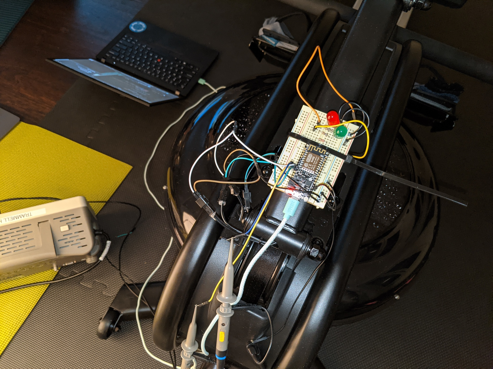
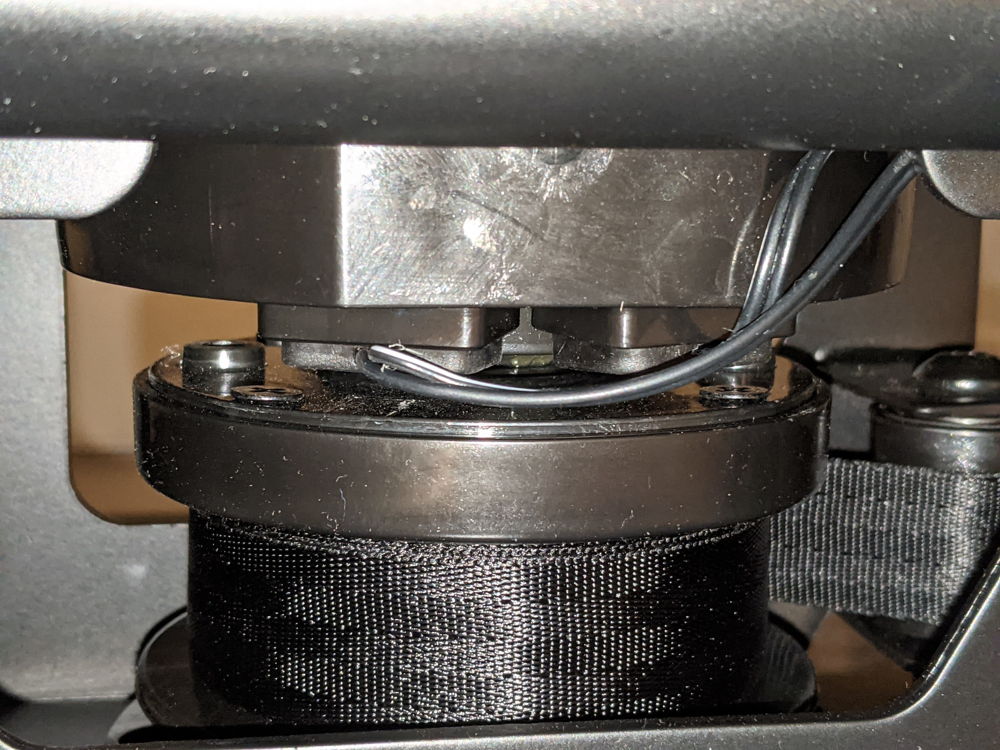
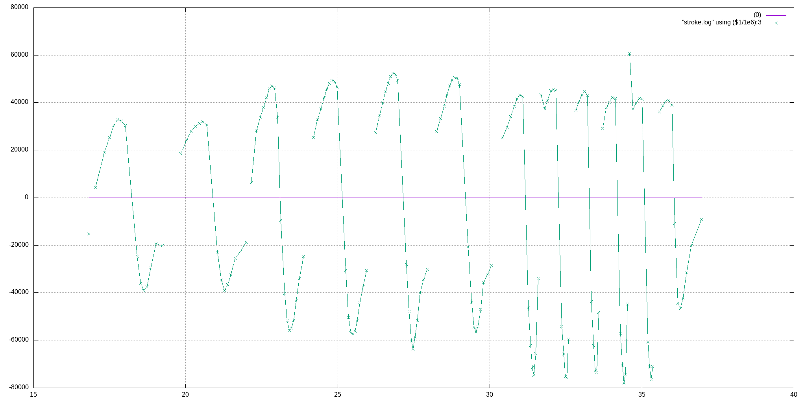

Adds an interface for the [VIRTUFIT WATER RESISTANCE ROW 1000](https://virtufit.nl/product/virtufit-foldable-water-resistance-row-1000-roeitrainer/) rowing machine to provide custom stats.  In extreme early development stage.

## Electrical Interface



Two magnetic sensors configured for quadrature encoding of
direction and velocity.  The cable spool has two magnets on it
and provides around nine data points on each stroke.

The sensors are connected to a 3.3V input pullup and pull the line
low when the magnet passes it.  There is a glitch when the magnet is
directly underneath, which can cause issues at low speed and requires
a debounce filter on the input.

## Software Interface



Serial 115200 baud, prints columns of data.

To update the embedded HTML:
```
xxd -i < workout/index.html > erg_code/index.html.h
```

## BLE FTMS

TODO.

* https://www.bluetooth.com/specifications/specs/fitness-machine-service-1-0/
* https://jjmtaylor.com/post/fitness-machine-service-ftms/
* https://www.instructables.com/DIY-Indoor-Bike-Smart-Trainer/?cb=1604870523

